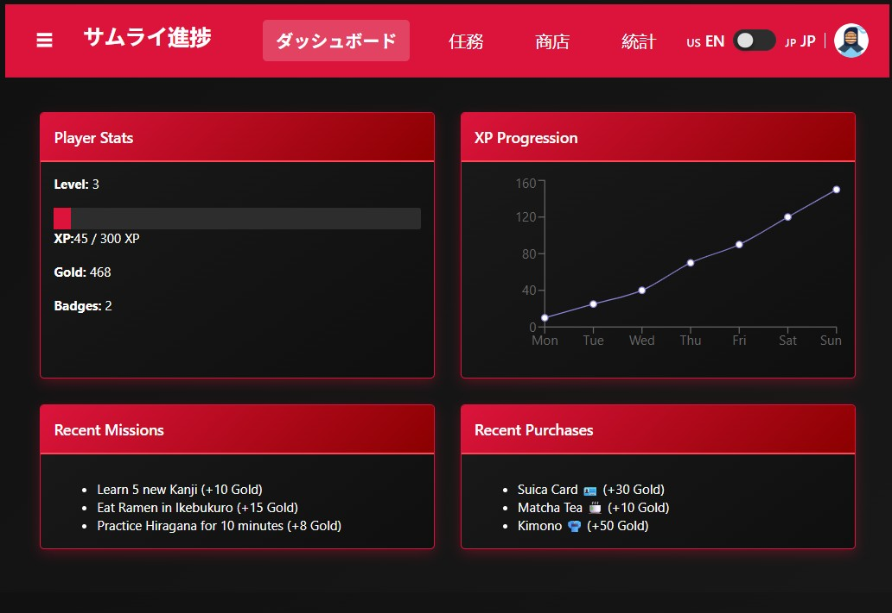
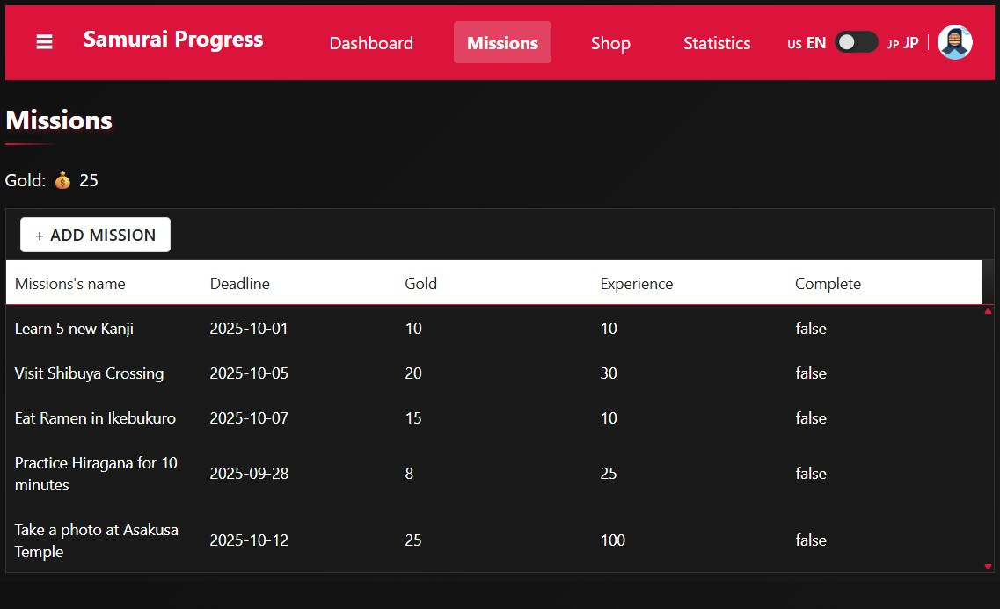
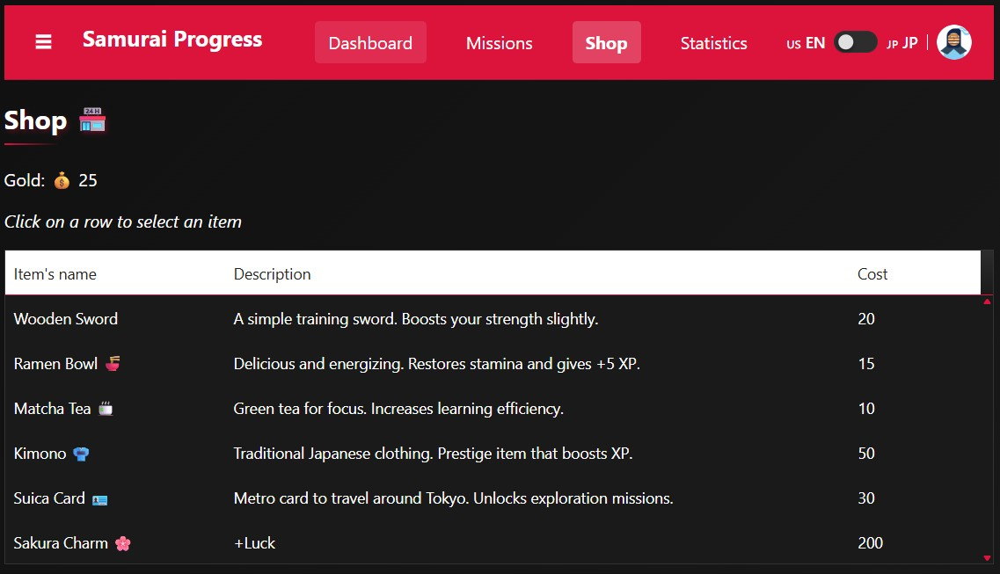
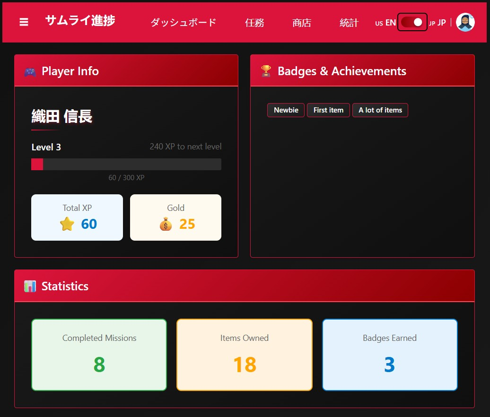
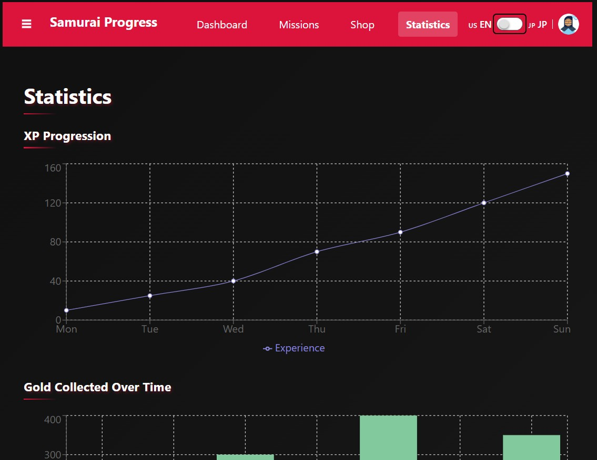

# Samurai Progress Dashboard

A gamified progress tracker that combines Japanese language learning with travel goal tracking. Transform your study sessions and Japan trip planning into an engaging RPG-like experience.


## About This Project

This project was built for the [KendoReact Free Components Challenge](https://dev.to/challenges/kendoreact-2025-09-10).

**Read the full blog post**: [Samurai Progress Dashboard: Gamifying Japanese Learning with KendoReact](https://dev.to/leopaul29/samurai-progress-dashboard-gamifying-japanese-learning-with-kendoreact-56hf)

## Live Demo

**[https://samurai-progress-dashboard.vercel.app/](https://samurai-progress-dashboard.vercel.app/)**

## Features

- **Mission System**: Track learning goals and travel objectives with deadlines and rewards
- **Shop System**: Purchase virtual items using earned gold
- **Statistics Dashboard**: Visualize XP progression with interactive charts
- **Badge System**: Earn achievements as you complete missions
- **Bilingual Interface**: Full English/Japanese translation toggle
- **Samurai Theme**: Dark red & black aesthetic inspired by Japanese warrior culture
- **Gamification**: XP, levels, gold currency, and RPG-style progression

## Screenshots

### Dashboard

*Overview with player stats, XP progression chart, recent missions, and purchases*

### Missions

*Mission management with inline editing and completion tracking*

### Shop

*Purchase items using earned gold*

### Profile

*Player info, badges, and statistics*

### Statistics

*XP progression charts and analytics*

## Tech Stack

### Core
- **React 18.3** - UI library
- **TypeScript 5.6** - Type safety
- **Vite 6.0** - Build tool and dev server

### UI Components
- **KendoReact 12.1** - Free component library
    - Grid (data tables)
    - TabStrip (navigation)
    - Cards (layout)
    - Buttons, Chips, Switch
    - ProgressBar, Notifications
    - DropDownList, Indicators

### Additional Libraries
- **react-i18next 15.1** - Internationalization
- **i18next-browser-languagedetector 8.0** - Auto language detection
- **Recharts 2.15** - Data visualization
- **@progress/kendo-theme-fluent** - Custom themed styling

## Project Structure

```
samurai-progress-dashboard/
├── screenshots/
│   ├── dashboard.png
│   ├── missions.png
│   ├── shop.png
│   ├── profile.png
│   └── stats.png
├── README.md
└── CHALLENGE.md
├── src/
│   ├── components/
│   │   ├── MainLayout.tsx          # Main tab navigation
│   │   ├── LanguageSwitch.tsx      # EN/JP language toggle
│   │   └── MissionList.tsx         # Mission grid component
│   ├── pages/
│   │   ├── Dashboard.tsx           # Overview with stats
│   │   ├── Missions.tsx            # Mission management
│   │   ├── Shop.tsx                # Item purchase system
│   │   ├── Stats.tsx               # Charts and analytics
│   │   └── Profile.tsx             # Player info and badges
│   ├── contexts/
│   │   └── GameContext.tsx         # Global game state
│   ├── i18n/
│   │   ├── config.ts               # i18next configuration
│   │   ├── en.json                 # English translations
│   │   └── jp.json                 # Japanese translations
│   ├── types/
│   │   └── types.tsx               # TypeScript interfaces
│   ├── styles/
│   │   └── samurai-theme.css       # Custom theme
│   ├── App.tsx
│   └── main.tsx
└── package.json
```

## Getting Started

### Prerequisites

- Node.js 18+
- npm or yarn

### Installation

1. Clone the repository:
```bash
git clone https://github.com/leopaul29/Samurai-Progress-Dashboard.git
cd Samurai-Progress-Dashboard
```

2. Install dependencies:
```bash
npm install
```

3. Start the development server:
```bash
npm run dev
```

4. Open your browser to `http://localhost:5173`

### Build for Production

```bash
npm run build
```

The build output will be in the `dist/` directory.

## Usage

### Dashboard
View your player stats, XP progression chart, recent missions, and purchases.

### Missions
- Click "+ ADD MISSION" to create new tasks
- Edit mission details inline by clicking cells
- Check the "Complete" checkbox to mark missions as done
- Earn gold and XP upon completion

### Shop
- Click on a row to select an item
- If you have enough gold, click "Buy" to purchase
- Items are added to your inventory and grant badges

### Statistics
View detailed charts of your XP progression over time with mock weekly data.

### Profile
- See your level, XP progress, and total gold
- View earned badges and achievements
- Check your statistics (completed missions, items owned, badges earned)
- Toggle language between English and Japanese

## Key Features Implementation

### Creative Workarounds for Free Components

Since custom cell renderers are a premium feature in KendoReact Grid, I implemented creative UX patterns:

**Mission Completion**: Uses checkbox editor instead of dropdown (todo → ongoing → done)
```typescript
<GridColumn field="status" title="Done" editor="boolean" />
```

**Shop Purchases**: Row selection + external buy button instead of inline action buttons
```typescript
<Grid 
  data={data}
  onRowClick={handleRowClick}
  selected={selectedIds}
/>
```

### Internationalization

Full bilingual support with automatic language detection:
```typescript
const { t, i18n } = useTranslation();
i18n.changeLanguage('jp'); // Switch to Japanese
```

### Data Visualization

Recharts integration for XP progression tracking:
```typescript
<LineChart data={weeklyXpData}>
  <Line type="monotone" dataKey="xp" stroke="#dc143c" />
</LineChart>
```

### Custom Theming

Complete samurai-inspired dark theme with:
- Red (#dc143c) and black (#1a1a1a) color palette
- CSS overrides for all KendoReact components
- High contrast for accessibility
- Japanese aesthetic elements

## Configuration

### Adding Translations

Edit `src/i18n/en.json` or `src/i18n/jp.json`:
```json
{
  "dashboardtitle": "Dashboard",
  "missions": "Missions"
}
```

### Customizing Theme Colors

Edit `src/styles/samurai-theme.css`:
```css
:root {
  --kendo-color-primary: #dc143c;
  --kendo-body-bg: #0f0f0f;
}
```

## Future Enhancements

- Data persistence with localStorage or backend
- More shop items and badge types
- Mission templates (JLPT prep, travel checklist)
- Social features (leaderboards, friend challenges)
- Mobile responsive improvements
- Integration with Anki stats API

## Contributing

Contributions are welcome! Please feel free to submit a Pull Request.

1. Fork the project
2. Create your feature branch (`git checkout -b feature/AmazingFeature`)
3. Commit your changes (`git commit -m 'Add some AmazingFeature'`)
4. Push to the branch (`git push origin feature/AmazingFeature`)
5. Open a Pull Request

## License

This project is licensed under the MIT License - see the LICENSE file for details.

## Acknowledgments

- KendoReact team for excellent free components and documentation
- Oda Nobunaga for the historical inspiration
- Japanese culture and samurai aesthetic
- Built for the [KendoReact Free Components Challenge](https://dev.to/challenges/kendoreact-2025-09-10)

## Author

**Leopaud**
- GitHub: [@leopaul29](https://github.com/leopaul29)

## Support

If you found this project helpful, please give it a star on GitHub!

---

Made with React + KendoReact + TypeScript